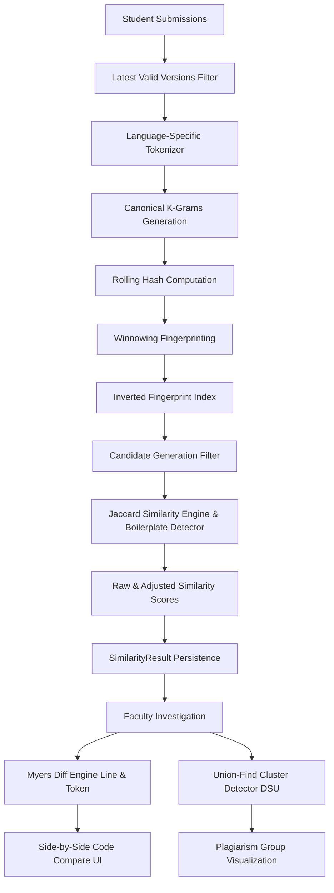

# CodeShield / CodeGuard

> **Enterprise Multi-Language Code Plagiarism & Similarity Detection System**  
> Scalable candidate generation, robust document winnowing, real-time Myers code diffing, and Union-Find plagiarism cluster detection.

---

## 🌟 Overview

**CodeShield** (also referred to as **CodeGuard**) is an end-to-end code plagiarism analysis and evidence visualization platform designed for computer science education and automated academic integrity enforcement. 

Rather than relying on naive pairwise comparisons or simple text matching, CodeShield implements an advanced algorithmic pipeline combining **tokenization**, **winnowing fingerprinting**, **inverted index candidate generation**, **Myers shortest edit script code diffing**, and **Union-Find cluster detection**.

---

## ⚡ Core Algorithmic Architecture



### 1. Multi-Language Token Normalization
Raw source code is passed to language-specific lexers for **Python, JavaScript, Java, C, C++, and C#**. Comments and whitespace are stripped while variables, literals, keywords, and operators are mapped to normalized token categories (`VAR`, `NUM`, `IF`, `FOR`, `OPERATOR`). This guarantees resilience against variable renaming, comment insertion, and cosmetic reformatting.

### 2. K-Grams & Winnowing Fingerprinting
Normalized token streams are split into contiguous $k$-grams ($k=5$). Each $k$-gram is hashed into a numeric fingerprint. The **Winnowing algorithm** evaluates windows of hashes ($w=4$) to select minimum hashes per window, producing a compact, position-mapped set of document fingerprints invariant to local insertion and deletion.

### 3. Inverted Index & Candidate Generation
To prevent scaling bottlenecks ($O(n^2)$ pairwise comparisons across 100+ submissions), CodeShield builds an **Inverted Fingerprint Index** (`hash -> submissionId[]`). Submissions sharing winnowed fingerprints generate candidate pairs (`subA < subB`). Non-overlapping pairs are filtered out early, yielding dramatic pair-count reductions ($0\%\text{--}100\%$).

### 4. Boilerplate-Aware Similarity Engine
Professor-provided starter code is fingerprinted automatically. Overlapping starter code fingerprints are down-weighted during Jaccard similarity scoring to eliminate false positives on template code.

### 5. Myers Shortest Edit Script (SES) Diff Engine
When a faculty member inspects a suspicious pair, the backend executes a pure-JavaScript **Myers Diff Algorithm** operating at both line and token levels. Edit operations (`equal`, `delete`, `insert`, `modify`) are mapped back to verbatim original source text, line numbers, and character offsets (`startOffset`, `endOffset`) for side-by-side Monaco editor visualization. Large file protection guards automatically fall back to line-level diffs for massive source files.

### 6. Union-Find Plagiarism Cluster Detection
To detect plagiarism rings where 4--5 students share or copy code from the same source, CodeShield applies a **Disjoint Set Union (DSU)** algorithm with **Path Compression** and **Union by Rank**. Submissions with pairwise similarity $\ge \text{threshold}$ are merged into connected components. Clusters of size $\ge 2$ surface as grouped plagiarism rings with average similarity, peak pair metrics, and submission timestamp gap analytics.

---

## 🛠️ Tech Stack & Key Technologies

- **Frontend:** React 18, Vite, Monaco Editor (`@monaco-editor/react`), Recharts, Vanilla CSS (CSS Variables)
- **Backend:** Node.js, Express, MongoDB / Mongoose, In-Memory MongoDB Fallback, BullMQ, Redis
- **Testing:** Vitest (79 unit tests across 8 test suites)
- **Algorithms:** Winnowing Fingerprinting, Inverted Indexing, Myers Shortest Edit Script (SES), Union-Find (Disjoint Set Union)

---

## 📁 Repository Structure

```text
CodeShield/
├── client/                     # Vite + React Frontend Application
│   ├── src/
│   │   ├── components/         # Navigation, Modals, Shared UI
│   │   ├── context/            # Authentication Context
│   │   ├── pages/              # Landing, Dashboards, Results, Compare Code
│   │   └── services/           # Axios API Client
│   └── package.json
├── server/                     # Node.js + Express Backend API
│   ├── src/
│   │   ├── config/             # Environment, Database, Redis Config
│   │   ├── controllers/        # Assignment, Analysis, Auth Controllers
│   │   ├── middleware/         # JWT Authentication & RBAC Middleware
│   │   ├── models/             # Mongoose Models (Assignment, Submission, SimilarityResult)
│   │   ├── queues/             # BullMQ Analysis Queue
│   │   ├── routes/             # Express API Routes
│   │   ├── services/
│   │   │   ├── boilerplate/    # Starter Code Detection
│   │   │   ├── diff/           # Myers Code Diff Engine & Tests
│   │   │   ├── explanation/    # Natural Language Evidence Generator
│   │   │   ├── fingerprint/    # K-Grams, Hashing & Winnowing
│   │   │   ├── similarity/     # Candidate Generator, Jaccard & Union-Find Clusters
│   │   │   └── tokenizer/      # Multi-Language Lexers (PY, JS, Java, C, C++, C#)
│   │   └── workers/            # BullMQ Async Analysis Worker
│   └── package.json
└── README.md
```

---

## 🚀 Getting Started

### Prerequisites

- **Node.js** (v18.0.0 or higher)
- **npm** (v9.0.0 or higher)
- **MongoDB** (Optional -- falls back to automatic `MongoMemoryServer` if local MongoDB is offline)
- **Redis** (Optional -- falls back to `setImmediate` async processing if Redis is offline)

### Installation & Setup

1. **Clone the repository:**
   ```bash
   git clone https://github.com/naitiiik31/CodeShield.git
   cd CodeShield
   ```

2. **Install dependencies:**
   ```bash
   npm install
   ```

3. **Start the Development Servers (Client + Server concurrently):**
   ```bash
   npm run dev
   ```
   - **Frontend:** Runs on `http://localhost:5173`
   - **Backend API:** Runs on `http://localhost:5000`

---

## 🧪 Running Tests

To run the complete backend unit test suite (79 tests covering tokenizers, winnowing, candidate generation, Myers diff, and Union-Find clusters):

```bash
cd server
npm test
```

To build the client application for production:

```bash
cd client
npm run build
```

---

## 🔑 Key API Endpoints

| Method | Endpoint | Access | Description |
| :--- | :--- | :--- | :--- |
| `POST` | `/api/auth/register` | Public | Student or Professor registration |
| `POST` | `/api/auth/login` | Public | JWT Authentication login |
| `GET` | `/api/assignments/:id/results` | Faculty | Ranked pairwise similarity results & distribution |
| `GET` | `/api/assignments/:id/clusters` | Faculty | Union-Find plagiarism clusters for assignment |
| `GET` | `/api/results/:id/detail` | Faculty | Detailed result with Myers diff operations |
| `POST` | `/api/assignments/:id/analyze` | Faculty | Trigger BullMQ / async plagiarism analysis job |

---

## 💼 Interview Talking Point

> *"I built a scalable multi-language code plagiarism engine in JavaScript. The platform uses a language-aware tokenizer and winnowing fingerprinting pipeline paired with an inverted fingerprint index to eliminate redundant pairwise comparisons ($O(n^2)$ down to actual candidate pairs). Suspicious submissions are grouped into plagiarism rings using a Union-Find (Disjoint Set Union) clustering algorithm with path compression, while individual code pairs are analyzed using a real Myers shortest-edit-script diff engine to highlight line and token changes for faculty investigation."*
